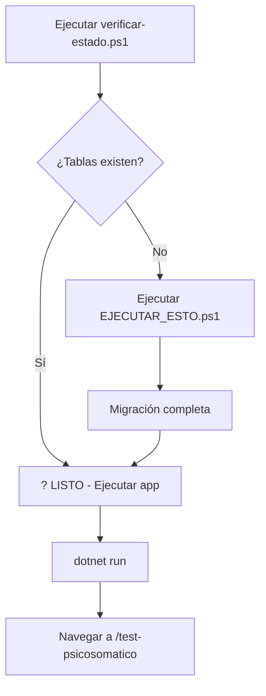

# ? TEST PSICOSOMÁTICO - INSTRUCCIONES ACTUALIZADAS

## ?? Tu Configuración Actual

**Servidor:** `LAPTOP-DAVID\SQLEXPRESS` (SQL Server Express)  
**Base de Datos:** `Salutia` (? Ya existe con usuarios)  
**Autenticación:** Windows (Trusted_Connection)

---

## ?? OPCIÓN 1: Verificar Estado Actual (Recomendado)

**Primero, verifica si las tablas ya existen:**

```powershell
.\verificar-estado.ps1
```

Este script te dirá:
- ? Si la conexión funciona
- ? Si la base de datos existe
- ? Cuántos usuarios hay
- ? Si las tablas del test están creadas (8 tablas)
- ? Si hay tests completados

### Si el script dice: "SISTEMA LISTO PARA USAR"
**¡No necesitas hacer nada más!** Solo ejecuta:

```powershell
dotnet run --project ".\Salutia Wep App\Salutia Wep App.csproj"
```

### Si el script dice: "REQUIERE MIGRACIÓN"
Continúa con la **OPCIÓN 2** abajo.

---

## ?? OPCIÓN 2: Ejecutar Migración

**Si las tablas NO existen, ejecuta:**

```powershell
.\EJECUTAR_ESTO.ps1
```

Este script actualizado:
- ? Usa **SQL Server Express** (no LocalDB)
- ? Verifica la conexión a tu servidor
- ? Comprueba que la BD `Salutia` existe
- ? Verifica cuántos usuarios tienes
- ? Detecta si las tablas ya existen
- ? Crea las 8 tablas necesarias
- ? Verifica que todo se creó correctamente

---

## ?? Las 8 Tablas que se Crean

| # | Tabla | Descripción |
|---|-------|-------------|
| 1 | `PsychosomaticTests` | Test principal (1 por paciente) |
| 2 | `TestWords` | 10 palabras que causan malestar |
| 3 | `TestPhrases` | 10 frases asociadas |
| 4 | `TestEmotions` | 10 emociones |
| 5 | `TestDiscomfortLevels` | 10 niveles de malestar (1-10) |
| 6 | `TestBodyParts` | 10 partes del cuerpo |
| 7 | `TestAssociatedPersons` | 10 personas asociadas |
| 8 | `TestMatrices` | **Matriz consolidada** (lo más importante) |

---

## ?? Si Hay Problemas

### Error: "No se puede conectar"

Verifica que SQL Server Express esté corriendo:

1. Presiona `Win + R`
2. Escribe: `services.msc`
3. Busca: **SQL Server (SQLEXPRESS)**
4. Estado debe ser: **Running**
5. Si no está corriendo, clic derecho ? **Start**

### Error: "Base de datos no existe"

El script te preguntará si quieres crearla. Responde **S**.

O créala manualmente:

```sql
USE master;
GO
CREATE DATABASE Salutia;
GO
```

### Error: "Las tablas ya existen"

El script te preguntará si quieres recrearlas:
- **S** = Elimina y recrea (?? perderás datos del test)
- **N** = Cancela (mantiene las tablas existentes)

---

## ? Verificación Manual

Si quieres verificar manualmente que todo está bien:

```powershell
sqlcmd -S "LAPTOP-DAVID\SQLEXPRESS" -d "Salutia" -E -Q "SELECT TABLE_NAME FROM INFORMATION_SCHEMA.TABLES WHERE TABLE_NAME LIKE 'Test%' OR TABLE_NAME = 'PsychosomaticTests'"
```

**Deberías ver:**
```
PsychosomaticTests
TestAssociatedPersons
TestBodyParts
TestDiscomfortLevels
TestEmotions
TestMatrices
TestPhrases
TestWords
```

---

## ?? Flujo Completo



---

## ?? Comandos Rápidos

```powershell
# 1. Verificar estado
.\verificar-estado.ps1

# 2. Si es necesario, ejecutar migración
.\EJECUTAR_ESTO.ps1

# 3. Compilar
dotnet build

# 4. Ejecutar
dotnet run --project ".\Salutia Wep App\Salutia Wep App.csproj"

# 5. Abrir navegador en:
# https://localhost:[puerto]/test-psicosomatico
```

---

## ?? URLs del Sistema

| URL | Descripción | Rol Requerido |
|-----|-------------|---------------|
| `/test-psicosomatico` | Hacer el test | Cualquier usuario autenticado |
| `/patient-tests` | Ver lista de tests | Doctor, Psychologist, SuperAdmin |
| `/test-results/{id}` | Ver resultados detallados | Doctor, Psychologist, SuperAdmin |

---

## ?? Diferencias con el Script Anterior

### ? Script Anterior (No funcionaba para ti)
- Usaba: `(localdb)\MSSQLLocalDB`
- Para: LocalDB
- Tu tienes: SQL Server Express

### ? Script Actual (Actualizado)
- Usa: `LAPTOP-DAVID\SQLEXPRESS`
- Para: SQL Server Express
- Compatible con tu configuración

---

## ?? Soporte

Si algo no funciona:

1. **Ejecuta primero:** `.\verificar-estado.ps1`
2. **Copia el resultado completo**
3. **Reporta el error específico**

---

## ? Checklist Final

- [ ] SQL Server Express está corriendo
- [ ] Base de datos `Salutia` existe
- [ ] `verificar-estado.ps1` ejecutado
- [ ] Si es necesario, `EJECUTAR_ESTO.ps1` ejecutado
- [ ] 8 tablas creadas correctamente
- [ ] `dotnet build` exitoso
- [ ] Aplicación ejecutándose
- [ ] Test accesible en el navegador

---

**¡Ahora todo está configurado para tu entorno específico!** ??

**EJECUTA PRIMERO:** `.\verificar-estado.ps1`
