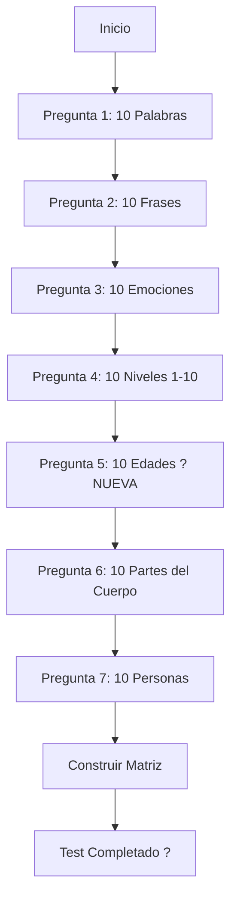

# ?? TEST PSICOSOMÁTICO - ACTUALIZACIÓN COMPLETA

## ? Cambios Realizados

Se ha actualizado el Test Psicosomático con una nueva pregunta y reorganización:

### ?? Nueva Estructura (7 Preguntas)

| # | Pregunta | Descripción |
|---|----------|-------------|
| 1 | **Palabras** | 10 palabras que causan malestar |
| 2 | **Frases** | Una frase para cada palabra |
| 3 | **Emociones** | Qué emoción siente con cada frase |
| 4 | **Nivel de Malestar** | Califique de 1 a 10 |
| 5 | **Edad** | ? **NUEVA**: A qué edad sintió el malestar |
| 6 | **Parte del Cuerpo** | En qué parte del cuerpo lo siente |
| 7 | **Persona Asociada** | A qué persona asocia el malestar |

---

## ?? Nueva Tabla en la Base de Datos

### TestAges

Almacena la edad en que se sintió el malestar por primera vez.

```sql
CREATE TABLE TestAges (
    Id INT IDENTITY(1,1) PRIMARY KEY,
    PsychosomaticTestId INT NOT NULL,
    WordNumber INT NOT NULL,
    Age NVARCHAR(50) NOT NULL,
    CreatedAt DATETIME2 NOT NULL DEFAULT GETUTCDATE(),
    
    CONSTRAINT FK_TestAges_PsychosomaticTests 
        FOREIGN KEY (PsychosomaticTestId) REFERENCES PsychosomaticTests(Id) ON DELETE CASCADE,
    CONSTRAINT CK_TestAges_WordNumber CHECK (WordNumber BETWEEN 1 AND 10)
);
```

---

## ??? Tablas Totales (9 tablas)

| # | Tabla | Registros | Descripción |
|---|-------|-----------|-------------|
| 1 | `PsychosomaticTests` | 1 | Test principal |
| 2 | `TestWords` | 10 | Palabras |
| 3 | `TestPhrases` | 10 | Frases |
| 4 | `TestEmotions` | 10 | Emociones |
| 5 | `TestDiscomfortLevels` | 10 | Niveles (1-10) |
| 6 | `TestAges` | 10 | ? Edades |
| 7 | `TestBodyParts` | 10 | Partes del cuerpo |
| 8 | `TestAssociatedPersons` | 10 | Personas |
| 9 | `TestMatrices` | 10 | **Matriz consolidada** |

---

## ?? Cómo Aplicar los Cambios

### Paso 1: Ejecutar la Migración

**Si las tablas NO existen** (primera vez):

```powershell
.\EJECUTAR_ESTO.ps1
```

**Si las tablas ya existen** (actualización):

Tienes 2 opciones:

#### Opción A: Recrear todas las tablas (?? Se pierden datos)

```powershell
.\EJECUTAR_ESTO.ps1
# Responder "S" cuando pregunte si desea recrear
```

#### Opción B: Agregar solo la nueva tabla (? Mantiene datos)

```sql
-- Ejecutar manualmente en SQL Server Management Studio
USE Salutia;
GO

-- Crear tabla TestAges
CREATE TABLE TestAges (
    Id INT IDENTITY(1,1) PRIMARY KEY,
    PsychosomaticTestId INT NOT NULL,
    WordNumber INT NOT NULL,
    Age NVARCHAR(50) NOT NULL,
    CreatedAt DATETIME2 NOT NULL DEFAULT GETUTCDATE(),
    
    CONSTRAINT FK_TestAges_PsychosomaticTests 
        FOREIGN KEY (PsychosomaticTestId) REFERENCES PsychosomaticTests(Id) ON DELETE CASCADE,
    CONSTRAINT CK_TestAges_WordNumber CHECK (WordNumber BETWEEN 1 AND 10)
);

CREATE UNIQUE NONCLUSTERED INDEX IX_TestAges_TestId_WordNumber 
    ON TestAges(PsychosomaticTestId, WordNumber);
GO

-- Agregar columna Age a TestMatrices
ALTER TABLE TestMatrices
ADD Age NVARCHAR(50) NOT NULL DEFAULT '';
GO

PRINT '? Actualización completada';
GO
```

### Paso 2: Compilar y Ejecutar

```powershell
# Compilar
dotnet build

# Ejecutar
dotnet run --project ".\Salutia Wep App\Salutia Wep App.csproj"
```

---

## ?? Interfaz de la Pregunta 5

La nueva pregunta muestra:

```
??????????????????????????????????????????????????
?  5. Escriba a qué edad sintió el malestar     ?
??????????????????????????????????????????????????

Para cada palabra y frase, indique la edad aproximada 
en la que sintió este malestar por primera vez.

??????????????????????????????????????????????????
? 1. [Palabra]                                   ?
? [Frase asociada]                               ?
?                                                ?
? Edad: [_________________]                      ?
?       Ej: 15 años, 5 años, Desde niño...       ?
??????????????????????????????????????????????????

... (Se repite para las 10 palabras)

[Siguiente Pregunta ?]
```

---

## ?? Actualización en la Matriz de Resultados

La matriz ahora incluye la columna **Edad**:

| # | Palabra | Frase | Emoción | Nivel | **Edad** | Cuerpo | Persona |
|---|---------|-------|---------|-------|----------|--------|---------|
| 1 | Miedo | Me da miedo... | Ansiedad | 8 | **15 años** | Pecho | Mi padre |
| 2 | Soledad | Me siento solo... | Tristeza | 7 | **10 años** | Estómago | Yo mismo |

---

## ?? Archivos Modificados

### 1. Modelos
- `PsychosomaticTestModels.cs`
  - ? Agregado `TestAge` class
  - ? Actualizado `TestMatrix` con propiedad `Age`

### 2. Base de Datos
- `ApplicationDbContext.cs`
  - ? Agregado `DbSet<TestAge>`
  - ? Configuración de `TestAge`
  - ? Actualizada configuración de `TestMatrix`

### 3. Migración SQL
- `CreatePsychosomaticTestTables.sql`
  - ? Agregada tabla `TestAges`
  - ? Actualizada tabla `TestMatrices` con columna `Age`

### 4. Servicio
- `PsychosomaticTestService.cs`
  - ? Agregado `SaveAgesAsync()`
  - ? Actualizado `BuildMatrixAsync()` para incluir edades
  - ? Actualizado orden de preguntas (5?6, 6?7)

### 5. Interfaz
- `TestPsicosomatico.razor`
  - ? Agregada Pregunta 5 (Edad)
  - ? Renumeradas Preguntas 6 y 7
  - ? Actualizada barra de progreso (7 preguntas)
  - ? Agregado array `ages[]`
  - ? Agregado método `SaveAgesAndNext()`

### 6. Resultados
- `TestPsychosomaticResults.razor`
  - ? Agregada columna Edad en la tabla
  - ? Actualizado ancho de columnas

### 7. Scripts
- `EJECUTAR_ESTO.ps1`
  - ? Actualizado para verificar 9 tablas
  - ? Actualizada confirmación con TestAges

---

## ? Verificación

### Comprobar que todo funciona:

```powershell
# 1. Verificar tablas
sqlcmd -S "LAPTOP-DAVID\SQLEXPRESS" -d "Salutia" -E -Q "SELECT TABLE_NAME FROM INFORMATION_SCHEMA.TABLES WHERE TABLE_NAME LIKE 'Test%' OR TABLE_NAME = 'PsychosomaticTests'"
```

**Deberías ver 9 tablas:**
```
PsychosomaticTests
TestAges             ? Nueva
TestAssociatedPersons
TestBodyParts
TestDiscomfortLevels
TestEmotions
TestMatrices
TestPhrases
TestWords
```

### Verificar estructura de TestAges:

```sql
SELECT COLUMN_NAME, DATA_TYPE, CHARACTER_MAXIMUM_LENGTH
FROM INFORMATION_SCHEMA.COLUMNS
WHERE TABLE_NAME = 'TestAges';
```

**Resultado esperado:**
```
COLUMN_NAME              DATA_TYPE    LENGTH
Id                      int          NULL
PsychosomaticTestId     int          NULL
WordNumber              int          NULL
Age                     nvarchar     50
CreatedAt               datetime2    NULL
```

### Verificar TestMatrices incluye Age:

```sql
SELECT COLUMN_NAME
FROM INFORMATION_SCHEMA.COLUMNS
WHERE TABLE_NAME = 'TestMatrices'
ORDER BY ORDINAL_POSITION;
```

**Debe incluir:**
```
Id
PsychosomaticTestId
WordNumber
Word
Phrase
Emotion
DiscomfortLevel
Age                     ? Debe estar presente
BodyPart
AssociatedPerson
CreatedAt
```

---

## ?? Flujo Actualizado del Test



---

## ?? Casos de Uso

### Ejemplo de respuesta para la Pregunta 5:

**Palabra:** Miedo  
**Frase:** Me da miedo la oscuridad  
**Edad:** `5 años` o `Desde niño` o `15 años aproximadamente`

El campo acepta:
- ? Edades numéricas: `5`, `15 años`
- ? Rangos: `Entre 10 y 15 años`
- ? Descripciones: `Desde niño`, `De adulto`, `No recuerdo`
- ? Máximo 50 caracteres

---

## ?? Troubleshooting

### Error: "Columna Age no existe en TestMatrices"

**Solución:**
```sql
ALTER TABLE TestMatrices ADD Age NVARCHAR(50) NOT NULL DEFAULT '';
```

### Error: "Tabla TestAges no existe"

**Solución:**
```powershell
.\EJECUTAR_ESTO.ps1
```

### Compilación exitosa pero error en ejecución

**Verificar:**
1. La base de datos tiene las 9 tablas
2. `TestMatrices` tiene la columna `Age`
3. La aplicación está usando la conexión correcta

---

## ?? Resumen de Cambios

| Componente | Antes | Ahora | Cambio |
|------------|-------|-------|--------|
| **Preguntas** | 6 | 7 | +1 (Edad) |
| **Tablas** | 8 | 9 | +1 (TestAges) |
| **Columnas en TestMatrices** | 8 | 9 | +1 (Age) |
| **Orden Pregunta "Parte del Cuerpo"** | 5 | 6 | Movida |
| **Orden Pregunta "Persona"** | 6 | 7 | Movida |

---

## ? Checklist de Implementación

- [x] Modelo `TestAge` creado
- [x] `TestMatrix.Age` agregado
- [x] `ApplicationDbContext` actualizado
- [x] Script SQL actualizado con `TestAges`
- [x] `TestMatrices` actualizada en SQL
- [x] Servicio `SaveAgesAsync()` implementado
- [x] `BuildMatrixAsync()` actualizado
- [x] Pregunta 5 agregada en UI
- [x] Preguntas 6 y 7 renumeradas
- [x] Resultados actualizados con columna Edad
- [x] Script PowerShell actualizado
- [x] Compilación exitosa ?

---

## ?? ¡Listo para Usar!

El test psicosomático ahora incluye la pregunta sobre la edad en que se sintió el malestar, proporcionando información más completa para el análisis terapéutico.

**Siguiente paso:**
```powershell
.\EJECUTAR_ESTO.ps1
```

O si quieres mantener datos existentes, ejecuta el script SQL de actualización manual.
